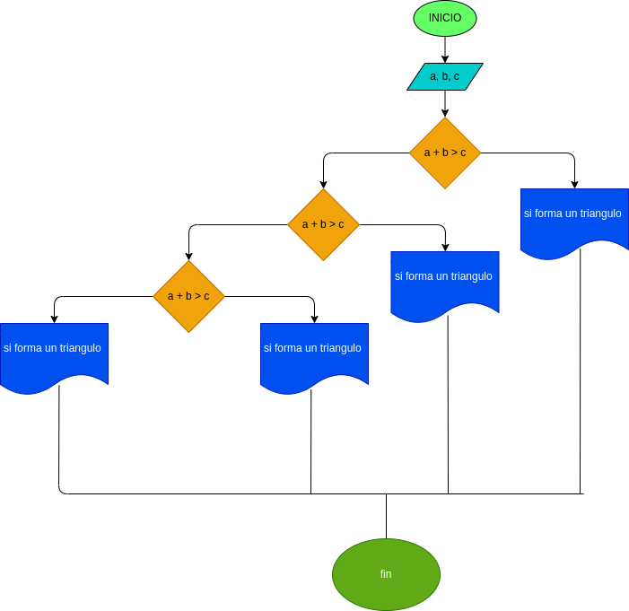

# Quiz instrucciones condicionales

### Realice el análisis, diseño y construcción para resolver el siguiente problema:

Dados tres números a, b y c, correspondientes a la longitud de los lados de una figura geométrica, determinar si pueden formar los lados de un triángulo.
# ANALISIS

--Variables de entrada 
a = lado de longitud a
b = lado de longitud b
c = lado de longitud c

--variables de proceso

a + b > c ,
a + c > b ,
b + c > a ,

--Variables de salida

Print : dice si son triangulos o no pueden serlo
## DISEÑO

### Diagrama de flujo
